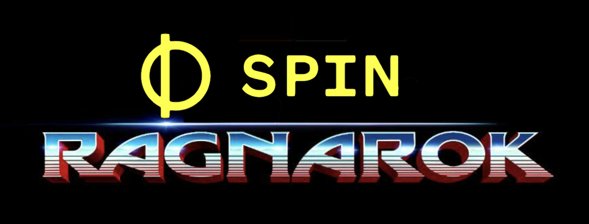

# spin-ragnarok

Central learning repo for playing with Fermyon Spin.

This repo was initialized via
[Bartholomew](https://github.com/fermyon/bartholomew) (aka "Bart")
using the baseline website template.
It has been edited to include things needed for stand-alone APIs
and other goodies, delivered by
[Spin](https://github.com/fermyon/spin).
Basically, I am using this repo as a dumping-ground for Spin-related experiments.
I'm just goofing around here, making chaos. And just like "Thor: Ragnarok"
may have reinvented the look-n-feel of the MCU, I believe that Spin may herald
changes to the experience of building & deploying WASM cloud functions.
Let Ragnarok begin!



(_See below re "Ragnarok Inspiration"_)

## Directory Structure

- `config/site.toml`: The main configuration file for the Bart site.
- `content/`: Site content goes here, in the form of markdown files.
- `scripts/` (advanced): Rhai scripts go here.
- `spin.toml`: The configuration file for the Spin application.
- `static/`: Static assets like images, CSS, and downloads go in here.
- `templates/`: Handlebars templates go here.
- `shortcodes/`: [Shortcodes](https://bartholomew.fermyon.dev/shortcodes) go here.
- `src/`: Rust code for any "non-Bart" capabilities, such as the `/api/*` endpoints.

## Run Site

```sh
spin watch
```

Now you can point your web browser to
[http://localhost:3000/](http://localhost:3000/)
to see your new Bartholomew site.

## Ragnarok Inspiration

Clearly, the repo's title is inspired by
[Thor: Ragnarok](https://en.wikipedia.org/wiki/Thor:_Ragnarok).
I do not intend to steal Marvel's IP. Rather, I just like the name.

Also, I am _not_ a graphic artist (clearly), but I used the Thor: Ragnarok
logo as the baseline for the image in this README file. If Marvel wants me
to take it down, I will. I do not intend to steal their IP; just to promote
and share enthusiasm about their movie.

### Thor: Ragnarok, the Movie

I encourage anybody that has not seen this movie to go watch it.
You can find it on
[Disney+](https://www.disneyplus.com/movies/marvel-studios-thor-ragnarok/3XqAT8UV8ojS)
or buy it on
[Amazon](https://www.amazon.com/Thor-Ragnarok-Theatrical-Chris-Hemsworth/dp/B076XWTHP8).
Or pick another delivery method of your choice.

The movie is often referenced as
[reinventing the MCU](https://www.google.com/search?q=thor+ragnarok+reinvent+mcu).

This Youtube clip is one of the official trailers.

[](https://www.youtube.com/watch?v=ue80QwXMRHg)

And this Youtube clip is "the Immigrant Song clip", which has mild spoilers.
I believe all of the "spoilers" were also shown in various theatrical trailers,
but I'm not sure. Anyway, do not press play if you are worried about spoilers.

[](https://www.youtube.com/watch?v=zJ9dFeZ5344)
